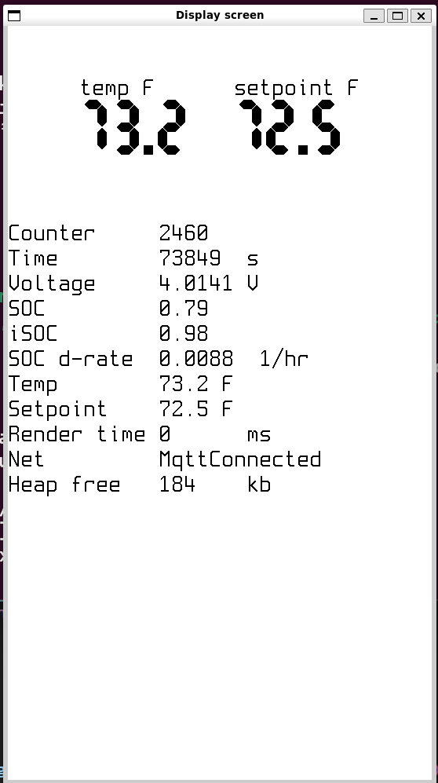

# HA Remote

## Summary

This is hobby project to control setpoint in HA remotely via M5Paper e-ink device. As it stands it can display 2 numbers on a screen (current temperature and setpoint), and adjust setpoint via up/down buttons. 

Expected battery life is about 4 days.

## Device

It works only on [M5Paper ESP](https://shop.m5stack.com/products/m5paper-esp32-development-kit-v1-1-960x540-4-7-eink-display-235-ppi) and NOT on [M5PaperS3](https://shop.m5stack.com/products/m5papers3-esp32s3-development-kit).

S3 version lacks dedicated e-ink controller and requires ESP to do bit-banging against a screen, which is not implemented.


## HA Integration

Device integrates with HA via WiFi and MQTT. Configuration is at `cfg.toml` and hardcoded into a firmware. 

Please update `cfg.toml` with your local setup.
`[app]
wifi_ssid = "<SSID>"
wifi_psk = "<Password>"
mqtt_server = "mqtt://<MQTT-SERVER>.local/"
mqtt_sensor_topic = "homeassistant/sensor/temp_sensor_temperature/state"
`

After compile-flash-run, value from `mqtt_sensor_topic` would be displayed on a screen, titled `temp F`, and new MQTT device will be registred in HA for `setpoint F`.  

## Getting Started

### Installation

There is no shipped binary, as configuration for wifi and mqtt server hardcoded in `cfg.toml`. To make it work please update configuration in `cfg.toml` and flash M5Paper with `cargo run`.

Dev-env setup is standard esp-idf rust, see [esp-idf setup instructions](https://github.com/esp-rs/esp-idf-template#prerequisites]).


1. Set up the development environment:
    - Standard ESP-IDF setup process
1. Clone the repository:
    ```sh
    git clone https://github.com/yourusername/ha_remote.git
    cd ha_remote
    ```
1. Update `cfg.toml` from `cfg.toml.template`
1. Flash the firmware:
    - `usbipd attach --wsl --busid <Device Hub Ref ex: 8-2>`
    - `cargo run`

### Development scripts

- `./display-1.sh` - run display simulator
- `./cargo-fix-all.sh` - usable cargo fix parameters
- `./attach-usb.ps1` - reminder on how to attach usb-device in WSL for flashing

### Example

